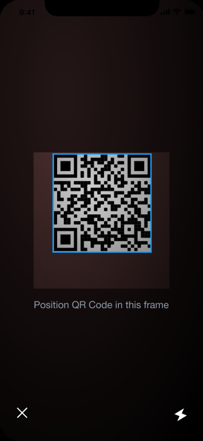

# React Native Barcode Scanner

We should have a barcode scanner in React Native.

The barcode scanner will have a translucent overlay, covering the camera preview except in the center. The center will have a square that reveals the camera preview area where the barcode should go.

when the camera scans a barcode, I would like the screen to flash white for 100ms and then fade to normal over 250 ms.

When a barcode is scanned, display the barcode text content and disable barcode scanning for 5 seconds. You can leave the camera running.
The user should be able to turn the flash on and off from the barcode scanning screen
The screen will look something like this:

https://www.figma.com/file/37zlUXOk8MUcXm1ZQ8zHHC/PktPal-Wallet-Wireframes?node-id=0%3A314

The button at the bottom left will close the View. (This View will be called from another View in the future)

The button at the bottom right toggles the flash light.

The square in the center is the transparent area over the camera preview

The dark area around that is the semi-transparent area over the camera preview.  People should still be able to see what the camera sees from here, but it's a little darker. Let's say 50% opacity, rgba(0, 0, 0, 0.5)
When the barcode is scanned, you can open an Alert for now, with the barcode information

This task corresponds to task 1167
https://projects.pkt.cash/projects/mobile-pktwallet/work_packages/1167
